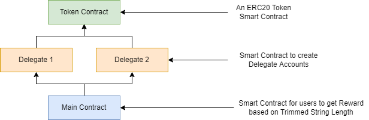
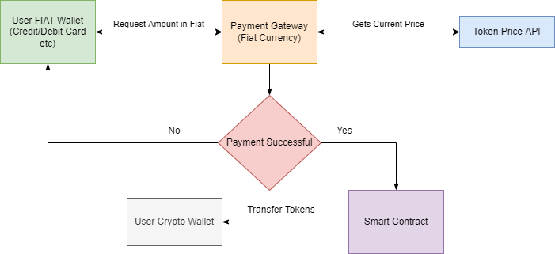

# tech-alchemy-assignment

## 1. ERC20 token smart contract with **trimStringMirroringChars** function.

### Highlevel Architecture

### Steps to Deploy

1.  Deploy the Token.sol Smart Contract.
2.  Deploy the First DelegateAccount.sol to deploy first delegate account with limit of 100 tokens. Pass Token.sol address and Token Limit (100) during the deployment.
3.  Again deploy the DelegateAccount.sol to deploy second delegate account with limit of 1000 tokens.
4. Deploy the Main.sol smart contract. Pass the address of Both DelegateAccount during the contract deployment. Account 1 is with limit of 100 and Account second is with limit of 1000.
5. Call the **getReward** function of Main Smart Constract function wth string[] to transfer tokens.

## 2. Integration of Web Wallets

Web wallets (Metamask, Coinbase) can be easily integrated into web apps using **WalletConnect** library. It is opensource library which provides access to different web wallets and mobile wallets as well.
Also, metamask globally injects the API to all websites which can be access through **window.ethereum**.

## 3. Purchase Tokens by using FIAT Currency

